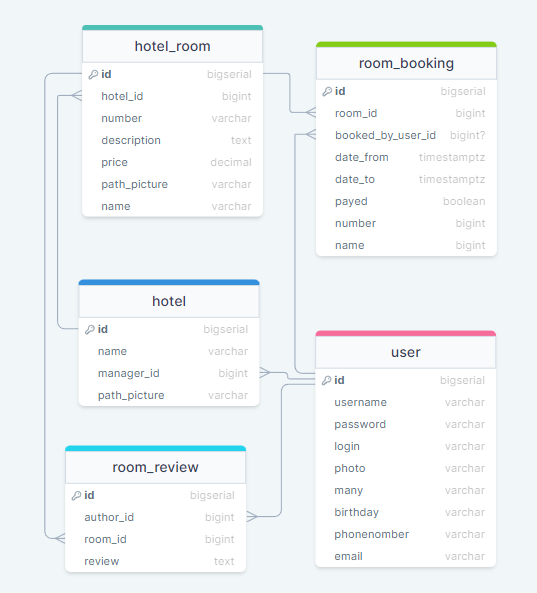

# Project Description
This is the project: [Hotel Booking](https://github.com/bublik-liquidator/Hotel)

## Technologies:
- Angular
- Node.js
- Express
- PostgreSQL 14
- Typescript
- Pino

## Launch 
-To compile and run the [server](https://github.com/bublik-liquidator/backend-for-Hotel): **index.ts** file, in the console `npx tsc` then  `npm run dev`.  
-Running the client side: in the console `ng serve`. Go to `http://localhost:4200 /`. The application will automatically reload if you change any of the source files.

**IMPORTANT**
The project is being modernized, so various bugs may occur. If you find any, please let me know😉

## Demo
An example of the application, docker files will be added later))

<h3>Database schema</h3>
<figure>
  
</figure>